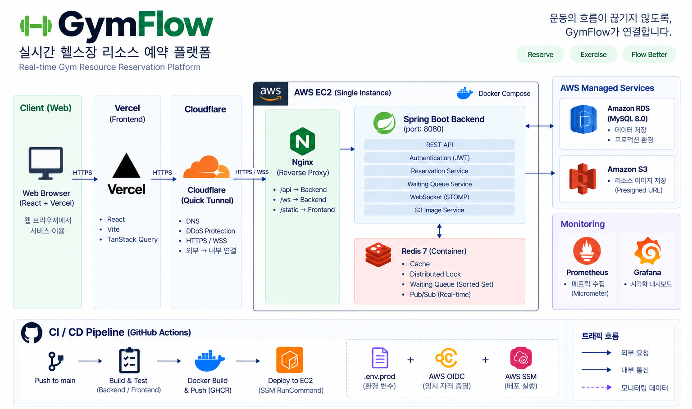
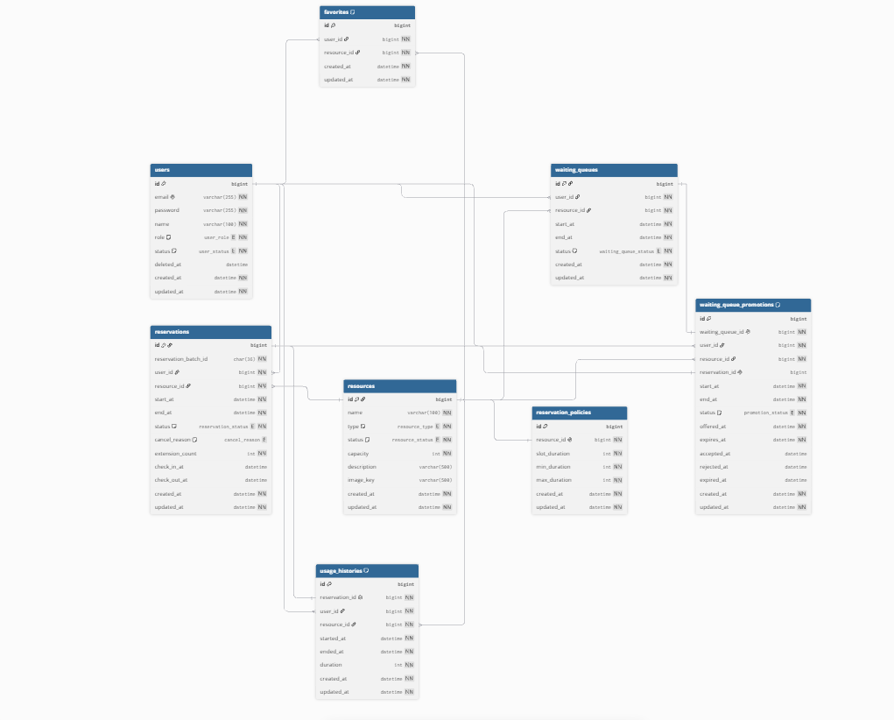
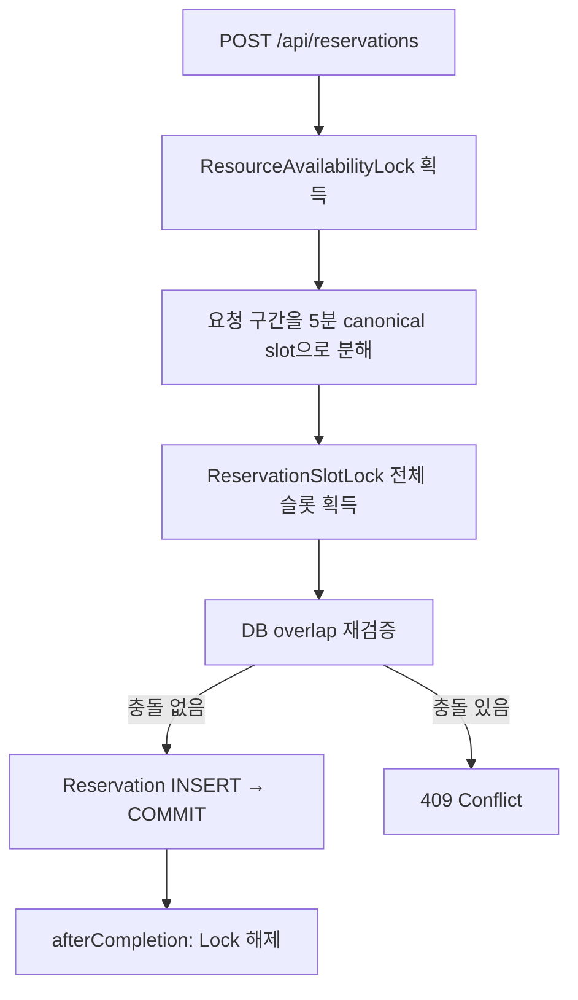

# GymFlow


> 다양한 헬스장 시설을 **Resource**로 추상화하고, 예약 · 대기열 · 대기열 승급(Promotion) · 실시간 알림을 하나의 일관된 모델로 처리하는 실시간 헬스장 Resource 예약 플랫폼

---

## 목차

1. [프로젝트 소개](#1-프로젝트-소개)
2. [핵심 기능](#2-핵심-기능)
3. [시스템 아키텍처](#3-시스템-아키텍처)
4. [기술 스택](#4-기술-스택)
5. [주요 도메인](#5-주요-도메인)
6. [DB / ERD](#6-db--erd)
7. [동시성 제어 및 실시간 처리](#7-동시성-제어-및-실시간-처리)
8. [테스트 및 성능 검증](#8-테스트-및-성능-검증)
9. [Repository 구조](#9-repository-구조)
10. [사전 요구사항](#10-사전-요구사항)
11. [실행 방법](#11-실행-방법)
12. [환경 변수](#12-환경-변수)
13. [서비스 접속](#13-서비스-접속)
14. [상세 문서](#14-상세-문서)

---

## 1. 프로젝트 소개

GymFlow는 헬스장의 운동기구뿐 아니라 PT Room, Locker, Stretch Zone, Sauna, Shower Room 등 예약 가능한 모든 대상을 **Resource**라는 하나의 개념으로 추상화한 예약 플랫폼이다.

운동기구(Machine) 중심으로 설계하면 새로운 예약 대상이 추가될 때마다 예약 로직을 함께 수정해야 하는 강한 결합이 생긴다. GymFlow는 `Reservation`이 구체적인 Machine이 아니라 `Resource`만 참조하도록 설계해, 새로운 `ResourceType`이 Enum에 추가되어도 예약 로직은 변경되지 않는 확장 가능한 구조(OCP)를 지향한다.

이 위에서 다음 흐름을 하나의 시스템으로 처리한다.

- Resource별 `ReservationPolicy`(슬롯 단위, 최소/최대 이용 시간)에 따른 시간 기반 예약
- 예약이 불가능할 때 대기열(`WaitingQueue`) 등록
- 예약 취소/NO_SHOW로 빈 슬롯이 생기면 대기열 승급(Promotion)
- Redis Pub/Sub + WebSocket(STOMP)을 통한 승급 실시간 알림
- 이용 완료 후 `UsageHistory` 기록과 통계
- Prometheus/Grafana 기반 운영 지표 모니터링

## 2. 핵심 기능

| 기능 | 설명 |
|---|---|
| 회원 인증 | 회원가입, 로그인, JWT 기반 인증 |
| Resource 조회 | 목록/상세 조회, 실시간 상태, 예약 가능 시간대(슬롯), 대표 이미지(Presigned URL) |
| 예약 | 생성, 취소, 연장, 내 예약 조회 |
| 체크인 / 체크아웃 | 시작 5분 전~시작 시각 체크인, 체크아웃 시 즉시 Resource 반환 |
| 대기열 | 등록, FIFO 순번 조회 |
| 대기열 승급(Promotion) | 취소/NO_SHOW 발생 시 자동 승급 기회 제공, 수락/거절 |
| 실시간 알림 | 대기열 승급 발생 시 WebSocket(STOMP)으로 즉시 알림 |
| Favorite | Resource 즐겨찾기 |
| 인기 Resource 랭킹 | Redis 기반 TOP N 및 특정 Resource 순위 조회 |
| 이용 이력 / 통계 | 기간 필터, Pagination, 총 이용 횟수·시간 통계 |
| 관리자: Resource 관리 | 등록/수정, 점검 모드 전환(ACTIVE/MAINTENANCE/INACTIVE), 대표 이미지 업로드/교체/삭제 |
| 관리자: 통계 | Resource별 누적 이용 통계 조회 |

## 3. 시스템 아키텍처



- **Frontend**는 Vercel에 배포되고, 백엔드로 향하는 HTTPS/WSS 요청은 **Cloudflare Quick Tunnel**을 거쳐 EC2의 **Nginx**로 전달된다. Cloudflare Quick Tunnel은 별도 도메인 등록 없이 임시 공개 URL을 발급받는 기능으로, 이 프로젝트에서는 포트폴리오 통합 환경을 위한 **임시 ingress**로 사용했다. 운영 등급(production-grade)의 안정적인 ingress는 아니며, 터널 프로세스가 재시작되면 URL이 바뀔 수 있다.
- Nginx는 일반 HTTP 요청과 WebSocket Upgrade 요청을 모두 백엔드 컨테이너로 프록시한다.
- Spring Boot는 **MySQL(RDS)**을 영속 Source of Truth로, **Redis**를 분산 락/대기열/TTL/캐시/랭킹/Pub-Sub 용도로, **S3**를 Resource 대표 이미지 저장소(Private bucket + Presigned URL)로 사용한다.
- 모니터링은 Spring Boot Actuator → Prometheus → Grafana 파이프라인으로 구성된다.
- 배포는 GitHub Actions가 GHCR에 이미지를 푸시하고, **AWS OIDC**로 발급받은 단기 자격 증명으로 **SSM RunCommand**를 통해 EC2에서 `docker compose pull/up`을 수행하는 방식이다(SSH 직접 접속 없음, 장기 Access Key 미사용).
- WebSocket(STOMP)으로 전파되는 이벤트는 **대기열 승급(Promotion) 알림 1종**뿐이다. 예약 생성/취소/연장, 체크인/체크아웃, Resource 상태 변경은 WebSocket으로 전파되지 않고 REST 응답으로만 반영된다.

## 4. 기술 스택

| Category | Technology |
|---|---|
| Backend | Java 21, Spring Boot 4.0.7, Spring Web MVC, Spring Data JPA |
| Security | Spring Security, JWT(jjwt) |
| Database | MySQL 8.0 (AWS RDS) |
| Redis | Spring Data Redis, Distributed Lock, Sorted Set, Pub/Sub, Keyspace Notification |
| Realtime | Spring WebSocket, STOMP |
| Storage | AWS S3 (Presigned URL), AWS SDK v2 |
| Monitoring | Spring Boot Actuator, Micrometer, Prometheus, Grafana |
| Test | JUnit 5, Mockito, Testcontainers(MySQL/Redis), k6 |
| Infra | Docker, Docker Compose, AWS EC2, Nginx |
| CI/CD | GitHub Actions, GHCR, AWS OIDC, AWS SSM RunCommand |
| Frontend | React 18, TypeScript, Vite, TanStack Query, React Router, Tailwind CSS, @stomp/stompjs |

## 5. 주요 도메인

GymFlow는 8개의 Entity(모두 Aggregate Root, `ReservationPolicy`만 `Resource` 내부 Entity)로 구성된다.

| Entity | 책임 |
|---|---|
| User | 인증/권한의 기준이 되는 회원 정보 |
| Resource | 예약 가능한 대상의 추상화 |
| ReservationPolicy | Resource별 예약 슬롯 단위·최소/최대 이용 시간 정책 |
| Reservation | 특정 Resource의 특정 시간대에 대한 점유 권리 |
| WaitingQueue | 예약 불가 시 등록하는 대기 요청 |
| WaitingQueuePromotion | 대기열 승급 기회(OFFERED)와 사용자 응답 상태 |
| Favorite | User-Resource 즐겨찾기 관계 |
| UsageHistory | 완료된 예약의 이용 이력 |

`WaitingQueue`(대기 순번)와 `WaitingQueuePromotion`(승급 기회 응답)을 의도적으로 분리한 이유, Aggregate 간 협력 방식 등 상세 설계는 [docs/02_Domain_Design.md](docs/02_Domain_Design.md)에서 다룬다.

## 6. DB / ERD




컬럼 단위 상세 [docs/02_Domain_Design.md](docs/02_Domain_Design.md)

## 7. 동시성 제어 및 실시간 처리

### Reservation Concurrency



- 모든 락은 `SETNX + TTL`로 획득하고 `GET==token` 확인 후 `DEL`하는 Lua 스크립트(CAS)로 해제한다.
- `ResourceAvailabilityLock`(Resource 전체 단위)이 예약 생성/Promotion 처리/관리자 상태 변경 사이의 상위 concurrency boundary 역할을 하고, 그 안에서 `ReservationSlotLock`이 요청 구간을 절대 5분 grid로 분해해 슬롯별로 락을 건다. 이는 "겹치지만 시작/종료 시각이 다른" 두 요청이 서로 다른 락 키를 얻어 직렬화를 피해가는 write-skew를 막기 위한 설계다.
- 락 획득만으로 정합성을 위임하지 않고, 락 내부에서 항상 MySQL 기준 overlap을 재검증한다(Redis는 보조 수단, MySQL이 Source of Truth).
- `TransactionAwareLockReleaser`가 락 해제를 메서드 종료 시점이 아닌 트랜잭션 `afterCompletion()` 시점으로 미뤄, "Redis는 해제됐지만 DB 커밋은 아직 안 된" 구간에 다른 요청이 끼어드는 문제를 방지한다.

### WaitingQueue

- Redis Sorted Set으로 대기 순번을 관리하며, score는 등록 시각이 아니라 Resource+시간대별로 채번하는 **단조 증가 sequence**를 사용한다.
- `INCR`(채번) → `ZADD`(등록) → `ZRANK`(순위 조회)를 하나의 Lua 스크립트로 원자 실행해, 동시 등록 시에도 순번 중복/역전이 발생하지 않는다(FIFO).

### Promotion / Realtime

- 예약 취소/NO_SHOW로 빈 슬롯이 생기면 `PromotionProcessor`가 대기 순번 1위에게 승급 기회(`WaitingQueuePromotion`, `OFFERED`)를 제공한다. 이 시점에는 아직 `Reservation`이 생성되지 않으며, 사용자가 수락해야 실제 예약이 만들어진다.
- 승급 알림은 트랜잭션 **커밋 이후**에만 Redis Pub/Sub로 발행되고(`WaitingQueueEventPublisher`), 이를 구독하는 서버가 `SimpMessagingTemplate`으로 해당 사용자에게 STOMP 메시지를 전달한다(`/user/queue/waiting-queue`).
- WebSocket으로 전파되는 이벤트는 이 대기열 승급 알림이 유일하다.

이 구조가 만들어지기까지 실제로 겪은 동시성 버그(WaitingQueue score 충돌, 정확한 타임스탬프 락 키로 인한 write-skew, self-invocation lock contention, 커밋 이전 알림 발행 등)와 그 해결 과정은 [docs/08_Troubleshooting.md](docs/08_Troubleshooting.md)에 정리되어 있다. 상세 Lock 인벤토리와 순서 보장은 [docs/04_Concurrency_Control.md](docs/04_Concurrency_Control.md), Redis 키 구조와 Pub/Sub 흐름은 [docs/05_Redis_Realtime.md](docs/05_Redis_Realtime.md)에서 다룬다.

## 8. 테스트 및 성능 검증

**Test Inventory** (Repository 기준 재측정): 테스트 클래스 **88개**, `@Test` 메서드 **816개**. Unit/Repository Slice(`@DataJpaTest`)/Redis Slice(`@DataRedisTest`)/MVC(`@WebMvcTest`)/Integration(`@SpringBootTest`)로 계층화되어 있으며, 동시성 검증은 Testcontainers(MySQL/Redis) 기반 통합 테스트로 별도 수행한다.

아래는 `k6/k6-summary/*.json`에 저장된 공식 측정 결과 중 대표 시나리오다(현재 측정 조건 기준이며, 결과를 일반화한 수치가 아니다).

| Scenario | Result |
|---|---|
| Same Resource / Same Time (`reservation-concurrency.js`) | 50개 동시 요청 중 성공 1건, 충돌(409) 49건 — 평균 235.97ms / p95 322.04ms |
| Non-contentious Baseline (`reservation-normal-load.js`) | 서로 다른 Resource/시간대 4건 전원 성공, 충돌 0건 — 평균 179.26ms / p95 186.90ms |
| Ramping Load Test (`reservation-sustained-load.js`) | 109 iteration 전원 성공(201), 충돌 0건 — 평균 64.19ms / p95 75.17ms / p99 101.19ms |
| WaitingQueue / Promotion (`waiting-queue-promotion-load.js`) | 20명 대기열 등록 전원 성공, 취소 발생 시 Promotion 1건 생성(수락/거절 흐름 정상 동작) |

- "Ramping Load Test"는 k6 `ramping-arrival-rate`로 짧게 부하를 올렸다 내리는 테스트이며, 장시간 고부하를 유지하는 Soak Test가 아니다.
- 위 수치는 이 Repository에 저장된 최종 k6 요약 결과 기준이며, 특정 하드웨어/네트워크 조건에서의 1회성 측정값이다. 일반적인 처리량/지연 보장을 의미하지 않는다.

테스트 계층별 상세, k6 시나리오 설계, Prometheus/Grafana 교차 검증 과정은 [docs/07_Test_Performance.md](docs/07_Test_Performance.md)에서 확인할 수 있다.

## 9. Repository 구조

```
GymFlow/
├── backend/                 # Spring Boot 애플리케이션
│   ├── src/main/java/com/gymflow/
│   │   ├── domain/           # user, resource, reservation, waitingqueue, favorite, usagehistory
│   │   └── global/            # common, config, infrastructure(s3), metrics, redis, security, websocket
│   ├── src/test/java/...      # Unit / Slice / Integration / Concurrency 테스트
│   ├── grafana/                # Grafana provisioning, dashboard JSON
│   ├── prometheus/             # Prometheus 설정
│   └── Dockerfile
├── frontend/                 # React + TypeScript (Vite)
│   └── src/{api,components,features,pages,routes,websocket}
├── k6/                       # k6 부하 테스트 스크립트 및 k6-summary/*.json
├── nginx/                    # Nginx reverse proxy 설정
├── docs/                     # 01~08 상세 설계/운영 문서
├── compose.yaml              # 로컬 개발용 Docker Compose
├── compose.prod.yaml         # 운영용 Docker Compose (Nginx + Backend + Redis)
├── compose.monitoring.yaml   # 운영 모니터링 스택 (Prometheus + Grafana)
└── README.md
```

## 10. 사전 요구사항

- Java 21 (Eclipse Temurin 권장)
- Docker / Docker Compose
- Node.js (프론트엔드 실행 시, `frontend/package.json`의 Vite 6 / React 18 기준)

## 11. 실행 방법

실행 전 필요한 환경 변수는 [12. 환경 변수](#12-환경-변수)를 참고한다.

### 1) 서버 / 배포 환경 실행

```bash
cp .env.prod.example .env.prod   # 값 채운 뒤
export BACKEND_IMAGE=ghcr.io/<owner>/gymflow-backend:<tag>
docker compose -f compose.prod.yaml up -d
```

`compose.prod.yaml`은 Nginx(`:80`) → Backend(내부 `:8080`만 expose) → Redis를 `gymflow-prod-network`로 묶어 실행한다. `BACKEND_IMAGE`는 GHCR에 푸시된 이미지 태그를 가리켜야 하며, 실제 운영 배포에서는 이 값과 컨테이너 재기동을 `.github/workflows/cd.yml`이 AWS OIDC + SSM RunCommand로 자동 수행한다(위 명령은 그 배포 스크립트를 수동으로 재현하는 경우를 위한 것). AWS RDS(MySQL)와 S3는 Compose가 실행하지 않는 외부 관리형 서비스이며, `.env.prod`의 `DB_URL`/`S3_RESOURCE_IMAGE_BUCKET`으로 연결한다.

### 2) 로컬 개발 실행

#### 2-1. MySQL / Redis

```bash
docker compose up -d mysql redis
```

`compose.yaml`의 `mysql`(`127.0.0.1:3307`)과 `redis`(`127.0.0.1:6379`) 서비스만 기동한다. 이 두 포트는 컨테이너 밖에서 Backend를 직접 실행할 수 있도록 호스트에 노출되어 있다.

#### 2-2. Backend

Mac/Linux:

```bash
cd backend
./gradlew bootRun
```

Windows:

```cmd
cd backend
gradlew.bat bootRun
```

`server.port` 설정이 없어 기본 포트는 `8080`이다. `application.yaml`이 `DB_URL`/`DB_USERNAME`/`DB_PASSWORD`/`REDIS_HOST`/`REDIS_PORT`/`JWT_SECRET`/`JWT_ACCESS_TOKEN_EXPIRATION`을 필수로 참조하므로, 위 2-1에서 노출한 포트에 맞춰 `DB_URL=jdbc:mysql://localhost:3307/gymflow`, `REDIS_HOST=localhost`, `REDIS_PORT=6379`를 포함해 환경 변수를 먼저 export해야 한다(나머지 값은 `backend/.env.example` 참고).

#### 2-3. Frontend

```bash
cd frontend
npm install
npm run dev
```

Vite dev server(`http://localhost:5173`)는 `/api`, `/ws` 요청을 `VITE_BACKEND_TARGET`(기본값 `http://localhost:8080`, 2-2의 Backend와 일치)으로 프록시한다.

### 3) 모니터링 실행

```bash
docker compose -f compose.monitoring.yaml up -d
```

`compose.monitoring.yaml`의 네트워크는 `gymflow_gymflow-prod-network`를 `external`로 참조하므로, 반드시 [1) 서버 / 배포 환경 실행](#1-서버--배포-환경-실행)으로 `compose.prod.yaml`을 먼저 기동한 뒤에 실행해야 한다. Grafana는 `127.0.0.1:3000`에만 바인딩되어 있어 외부에서 직접 접근할 수 없으며, SSH 로컬 포트 포워딩 등을 통해 접근한다. 상세는 [docs/06_Deployment_Monitoring.md](docs/06_Deployment_Monitoring.md)를 참고한다.

## 12. 환경 변수

`backend/.env.example` 기준 백엔드 환경 변수:

```env
DB_URL=jdbc:mysql://mysql:3306/gymflow
DB_USERNAME=gymflow
DB_PASSWORD=CHANGE_ME

REDIS_HOST=redis
REDIS_PORT=6379

JWT_SECRET=CHANGE_ME
JWT_ACCESS_TOKEN_EXPIRATION=CHANGE_ME

FRONTEND_ORIGIN=http://localhost:5173

AWS_REGION=ap-northeast-2
S3_RESOURCE_IMAGE_BUCKET=gymflow-resource-images

MYSQL_DATABASE=gymflow
MYSQL_USER=gymflow
MYSQL_PASSWORD=CHANGE_ME
MYSQL_ROOT_PASSWORD=CHANGE_ME
```

운영 배포(`compose.prod.yaml`)는 `.env.prod`(`.env.prod.example` 참고)를 사용하며 `DB_URL`이 AWS RDS 엔드포인트를 가리킨다는 점만 다르다. 프론트엔드는 기본적으로 별도 환경 변수 없이 same-origin으로 동작하며, 백엔드가 다른 origin에 있을 때만 `frontend/.env.example`의 `VITE_API_BASE_URL`/`VITE_WS_URL`을 설정한다.

AWS 자격 증명은 GitHub Actions(CI/CD)에서 OIDC로 단기 발급되며, EC2에서는 IAM Role(`GymFlowEC2Role`)을 통해 인증한다. 장기 Access Key는 어디에도 저장하지 않는다.

## 13. 서비스 접속

- **Frontend**: Vercel에 배포되어 있다.
- **Backend ingress**: Cloudflare Quick Tunnel(포트폴리오 통합 환경용 임시 ingress)을 통해 노출된다. 터널 URL은 프로세스 재시작 시 바뀔 수 있어 고정 주소로 문서화하지 않는다.
- **Monitoring**: Grafana는 `127.0.0.1:3000`에만 바인딩되어 있으며, SSH 로컬 포트 포워딩 등을 통해서만 접근 가능하다.

현재 AWS 인프라는 비용 절감을 위해 상시 실행되는 서비스가 아니므로, 위 구성 요소가 항상 접속 가능한 상태는 아니다.

## 14. 상세 문서

| Document | Description |
|---|---|
| [Project Overview](docs/01_Project_Overview.md) | 프로젝트 목적, 핵심 가치, 기능/비기능 요구사항, 사용자 시나리오 |
| [Domain Design](docs/02_Domain_Design.md) | Resource 추상화, Entity/Aggregate 구조, Lifecycle, Aggregate 경계 설계 |
| [Architecture](docs/03_Architecture.md) | 시스템 전체 구조, 백엔드 레이어, 인증 아키텍처, 이미지 저장 구조 |
| [Concurrency Control](docs/04_Concurrency_Control.md) | Redis 분산 락 종류/순서, 5분 canonical slot lock, TransactionAwareLockReleaser |
| [Redis & Realtime](docs/05_Redis_Realtime.md) | Redis 키 인벤토리, WaitingQueue FIFO, TTL Lifecycle, Pub/Sub → WebSocket 흐름 |
| [Deployment & Monitoring](docs/06_Deployment_Monitoring.md) | Docker/CI/CD, OIDC, Nginx, Prometheus/Grafana 대시보드 |
| [Test & Performance](docs/07_Test_Performance.md) | 테스트 전략/인벤토리, k6 시나리오별 측정 결과 |
| [Troubleshooting](docs/08_Troubleshooting.md) | 과거 동시성/실시간 버그의 원인과 해결 과정 |
