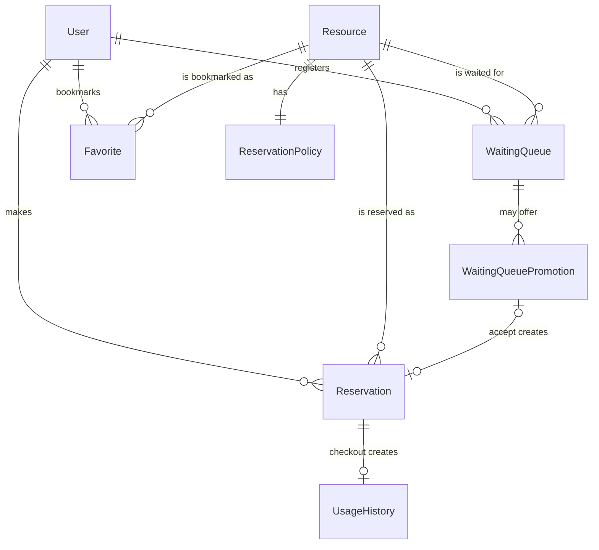
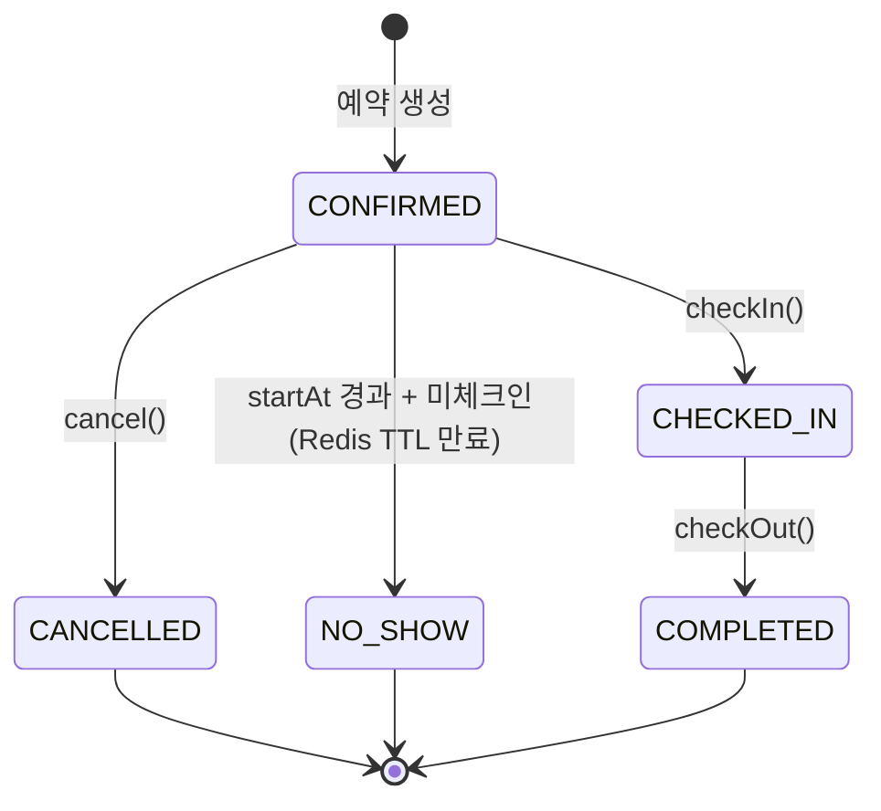
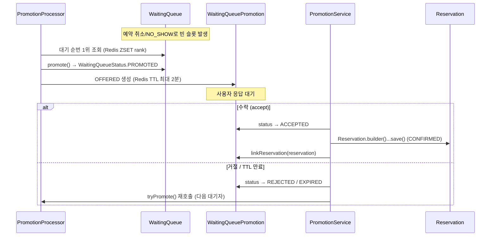

# GymFlow Domain Design

## Document Information

| 항목 | 내용 |
|------|------|
| Document | Domain Design |
| Version | v2.0 (02-1/02-2 통합, 최종 구현 기준) |
| Author | 정재윤 |
| Last Updated | 2026-09-04 |

이 문서는 기존 `02-1_Domain_Modeling.md`, `02-2_Aggregate_Design.md`를 최종 구현 기준으로 통합한 문서다. 두 문서는 Legacy 참고 자료로 유지되며, 이 문서와 내용이 다르면 이 문서를 따른다.

---

## 1. Domain Overview

GymFlow는 헬스장의 다양한 시설을 예약하고 관리하는 실시간 Resource Reservation Platform이다.

예약 대상은 운동기구(Machine)만을 의미하지 않는다. GymFlow는 예약 가능한 모든 대상을 **Resource**라는 하나의 개념으로 추상화한다. Machine 중심으로 설계하면 PT Room, Locker 같은 새로운 예약 대상이 추가될 때마다 예약 로직(Reservation)을 함께 수정해야 하는 강한 결합이 생긴다. Reservation이 Machine이 아니라 Resource를 참조하도록 설계하면, 새로운 Resource 타입이 추가되어도 예약 로직은 변경되지 않는다(OCP).

GymFlow 도메인이 해결하려는 핵심 문제:

- 동일 시간대 중복 예약 방지
- 예약 이후 체크인/체크아웃 관리
- 예약 연장
- 대기열 등록과 자동 승급
- Resource 이용 이력 및 통계

---

## 2. Resource Abstraction

### ADR-001: 왜 Machine이 아니라 Resource인가?

**Problem**

운동기구(Machine) 중심으로 설계하면 예약 시스템이 특정 도메인에 강하게 결합된다. PT Room, Locker 같은 새로운 예약 대상이 추가될 때마다 Reservation까지 수정해야 한다.

**Decision**

예약 가능한 모든 대상을 `Resource`로 추상화한다. `Reservation`은 Machine이 아니라 Resource를 참조한다. Resource의 세부 타입 구분은 `ResourceType` Enum으로, 예약 정책은 `ReservationPolicy` Entity로 관리한다.

**Consequence**

- 장점: 예약 로직 재사용, 새로운 Resource 타입 추가 용이, 높은 확장성
- 단점: 초기 설계가 다소 복잡함 (Resource가 자신의 세부 타입을 모르는 간접 구조)

이 결정은 최종 구현과 충돌하지 않는다.

### ResourceType

```
MACHINE, PT_ROOM, LOCKER, STRETCH_ZONE, SAUNA, SHOWER_ROOM
```

예약 시스템은 `ResourceType`의 구체적인 값을 알지 못하고 `Resource`만 참조하므로, 새로운 `ResourceType`이 추가되어도 예약 로직은 변경되지 않는다. 새로운 Resource 타입은 별도의 Profile Entity를 추가하는 방식이 아니라 Enum에 값을 추가하는 방식으로 확장한다.

---

## 3. Domain Model

GymFlow는 8개의 Entity로 구성된다. 모두 Aggregate Root이며, `ReservationPolicy`만 `Resource` 내부 Entity다.

| Entity | 역할 | 위치 |
|---|---|---|
| User | 인증/권한의 기준이 되는 회원 정보 | Aggregate Root |
| Resource | 예약 가능한 대상의 추상화 | Aggregate Root |
| ReservationPolicy | Resource별 예약 슬롯 단위/최소·최대 이용 시간 정책 | Resource Aggregate 내부 Entity (1:1) |
| Reservation | 특정 Resource의 특정 시간대에 대한 점유 권리 | Aggregate Root |
| WaitingQueue | 예약 불가 시 등록하는 대기 요청 | Aggregate Root |
| WaitingQueuePromotion | 대기열 승급 기회(OFFERED)와 사용자 응답 상태 | Aggregate Root |
| Favorite | User-Resource 즐겨찾기 관계 | Aggregate Root |
| UsageHistory | 완료된 예약의 이용 이력 | Aggregate Root |



모든 참조는 Aggregate Root를 통해서만 이루어진다(`@ManyToOne`/`@OneToOne` 객체 참조이며, 단순 FK id 필드가 아니다). `Reservation`은 `User`/`Resource`를 참조하지만 두 Aggregate의 내부 상태를 직접 변경하지 않는다.

---

## 4. ReservationPolicy

`ReservationPolicy`는 Resource별 예약 정책을 관리하는 내부 Entity다.

```
slotDuration  예약 가능한 최소 시간 단위
minDuration   최소 이용 시간
maxDuration   최대 이용 시간
```

- 독립적으로 존재할 수 없으며 반드시 하나의 Resource에 종속된다(1:1, `@OneToOne` + FK unique 제약).
- `Resource`는 `POST /api/admin/resources`로 `ReservationPolicy`와 함께 생성된다.
- `maxDuration >= minDuration`, `minDuration % slotDuration == 0`, `maxDuration % slotDuration == 0`을 만족해야 한다. 이 조합 검증은 Entity가 아니라 Service 레벨(`AdminResourceService`)에서 수행하며, Entity 자체는 각 값의 양수 여부와 `minDuration <= maxDuration`만 보장한다.
- 정책을 변경해도 이미 생성된 Reservation/WaitingQueue/OFFERED Promotion의 `startAt`/`endAt`은 소급 변경되지 않는다. 변경된 정책은 이후 신규 Reservation 생성과 기존 `CHECKED_IN` Reservation의 연장 요청부터 적용된다.

이 정책 판단(예약 가능 여부, 연장 가능 여부)은 별도의 Policy 클래스가 아니라 `ReservationService`, `ResourceService`, `AdminResourceService` 등 실제 Service 클래스 안에서 수행된다. 자세한 매핑은 [10. Domain Services / Responsibilities](#10-domain-services--responsibilities)를 참고한다.

---

## 5. Reservation Lifecycle

`ReservationStatus`: `CONFIRMED`, `CHECKED_IN`, `COMPLETED`, `CANCELLED`, `NO_SHOW`



- `CONFIRMED`/`CHECKED_IN` 상태만 Resource를 점유한 것으로 간주한다(`ReservationStatus.OCCUPYING_STATUSES`). `CANCELLED`/`NO_SHOW`/`COMPLETED`는 충돌 검사 대상에서 제외된다.
- 시간 구간이 정확히 맞닿는 예약(14:00~14:15와 14:15~14:30)은 충돌로 보지 않는다.
- 체크인은 `startAt - 5분`부터 `startAt`까지만 가능하다. 그 안에 체크인하지 않으면 Redis TTL 만료로 `NO_SHOW` 처리된다. 단, Promotion으로 생성된 예약은 이 시간창 대신 별도 정책을 따른다([6장](#6-waitingqueue--promotion) 참고).
- 체크아웃 시 `COMPLETED`로 전이되며, 같은 트랜잭션 안에서 `UsageHistory`가 생성된다.
- 예약 연장은 다음 예약이 존재하지 않고 `ReservationPolicy.maxDuration`을 넘지 않을 때만 가능하다.
- 취소 사유는 `CancelReason` Enum(`PERSONAL_REASON`, `SCHEDULE_CHANGE`, `WRONG_RESERVATION`, `OTHER`, `PROMOTION_CHECKIN_TIMEOUT`)으로 기록한다.

동시성 제어(Lock 종류, 5분 grid slot, 트랜잭션 경계)는 [04_Concurrency_Control.md](./04_Concurrency_Control.md)에서 다룬다.

---

## 6. WaitingQueue & Promotion

GymFlow는 대기열 등록(`WaitingQueue`)과 승급 기회 제공(`WaitingQueuePromotion`)을 의도적으로 분리된 두 Aggregate로 설계했다.

**왜 분리했는가**: `WaitingQueue`의 `PROMOTED` 상태는 "예약 우선 기회를 받았다"는 사실만 의미하며, 예약 생성 완료를 의미하지 않는다. 승급된 사용자가 응답하지 않거나 거절할 수 있고, 응답 대기 중에도 다른 요청과의 충돌 검증이 필요하다. 이 "수락 대기 중" 상태와 그 만료/거절을 `WaitingQueue` 자신의 상태만으로 표현하면 대기열 순번 관리 책임과 승급 응답 관리 책임이 뒤섞인다. 그래서 응답 대기 상태 전이(`OFFERED → ACCEPTED/REJECTED/EXPIRED`)는 별도 Aggregate인 `WaitingQueuePromotion`이 전담한다.

**핵심: OFFERED 시점에는 아직 Reservation이 생성되지 않는다.**



- `tryPromote()`(`PromotionProcessor`)는 Redis ZSET에서 다음 대기자를 조회해 `WaitingQueue.promote()`를 호출하고, `WaitingQueuePromotion`을 `OFFERED` 상태로 생성한다. 이 시점에는 `Reservation`이 존재하지 않는다.
- 사용자가 수락(`PromotionService.accept()`)하면 그제서야 `Reservation.builder()...build()` → `reservationRepository.save()`로 실제 `Reservation`(`CONFIRMED`)이 생성되고, `WaitingQueuePromotion.linkReservation()`으로 1:1 연결된다.
- 사용자가 거절하거나 OFFERED TTL(최대 2분)이 만료되면 `REJECTED`/`EXPIRED`로 전이되고, 같은 슬롯에 대해 `PromotionProcessor.tryPromote()`가 다시 호출되어 다음 대기자에게 기회가 넘어간다.
- ACCEPT로 생성된 예약은 체크인 가능 시간이 일반 예약과 다르다. `startAt`이 이미 지난 뒤에 수락이 일어날 수 있으므로, 체크인 가능 시간은 **수락 시각(`acceptedAt`)부터 1분**이며(`Reservation.checkInByPromotion()`), 그 안에 체크인하지 않으면 예약이 `CANCELLED`(`PROMOTION_CHECKIN_TIMEOUT`)로 취소되고 다음 대기자에게 재승급이 시도된다.
- 대기 순번(FIFO)과 TTL 만료 감지는 Redis가 담당하며, 상세는 [05_Redis_Realtime.md](./05_Redis_Realtime.md)에서 다룬다. Lock 경계는 [04_Concurrency_Control.md](./04_Concurrency_Control.md)에서 다룬다.

`WaitingQueueStatus`: `WAITING`, `PROMOTED`, `CANCELLED`
`PromotionStatus`: `OFFERED`, `ACCEPTED`, `REJECTED`, `EXPIRED`

---

## 7. UsageHistory

`UsageHistory`는 완료된 예약(`checkOutReservation()`)을 기반으로 실제 이용 이력을 별도의 영속 데이터로 관리한다.

```
reservation.checkOut();
UsageHistory usageHistory = UsageHistory.builder()
        .reservation(reservation)
        .user(reservation.getUser())
        .resource(reservation.getResource())
        .startedAt(reservation.getCheckInAt())
        .endedAt(reservation.getCheckOutAt())
        .build();
usageHistoryRepository.save(usageHistory);
```

**왜 Reservation 자체가 아니라 별도 Aggregate로 관리하는가**

- `Reservation`은 "현재 진행 중인 예약의 상태"를 표현하는 도메인이고, `UsageHistory`는 "과거에 실제로 사용했다는 사실"을 표현하는 통계용 Source of Truth다. 두 책임을 분리하면 통계 조회 시 `ReservationStatus`를 다시 JOIN해서 COMPLETED 여부를 재검증할 필요가 없다.
- `Resource`가 `INACTIVE`로 전환되어도(물리 삭제하지 않음) 과거 `UsageHistory` 조회/통계는 영향을 받지 않는다.
- `UsageHistory`에는 Resource 이름 등의 snapshot 컬럼을 두지 않는다. 조회 응답의 Resource name/type/status는 현재 Resource Entity를 JOIN해서 가져오므로, 관리자가 Resource 이름을 변경하면 과거 이력 조회에도 현재 이름이 노출된다.
- 생성 이후 수정/삭제하지 않는다.

이 생성은 별도의 이벤트 발행 없이 `ReservationService.checkOutReservation()` 트랜잭션 내부에서 직접 수행된다(Spring `ApplicationEvent` 기반 비동기 이벤트가 아니다).

인기 Resource 랭킹(Redis ZSET, 예약 생성 성공 횟수 기반)은 `UsageHistory` 기반 통계와는 별개의 지표이며 서로 섞어 계산하지 않는다. 랭킹 상세는 [05_Redis_Realtime.md](./05_Redis_Realtime.md)를 참고한다.

---

## 8. Favorite

`Favorite`는 User와 Resource를 연결하는 단순 관계 Aggregate다.

- 하나의 사용자는 동일한 Resource를 한 번만 즐겨찾기할 수 있다(`user_id + resource_id` unique 제약).
- 예약 가능 여부와 무관하게 등록할 수 있으며, 예약 프로세스와 독립적으로 동작한다.
- 하위 Entity/Value Object 없이 Aggregate Root 하나로 구성된다.

---

## 9. Aggregate & Consistency Boundary

GymFlow는 "논리적 Aggregate 경계"와 "실제 JPA annotation/물리 DB cardinality"를 구분해서 설계한다. 아래 세 관계는 겉보기엔 모두 1:1처럼 보이지만 구현 방식이 다르다.

| 관계 | JPA 매핑 | 물리 Cardinality | 일관성 보장 방식 |
|---|---|---|---|
| Resource ↔ ReservationPolicy | `Resource.reservationPolicy`가 `@OneToOne(mappedBy, cascade=ALL, orphanRemoval=true)`로 소유, `ReservationPolicy`가 FK unique 소유 측 | 물리 1:1 (FK unique) | 진짜 JPA Aggregate 내부 Entity — Resource 저장/삭제 시 cascade로 함께 처리되는 단일 트랜잭션 단위 |
| WaitingQueue ↔ WaitingQueuePromotion | `WaitingQueuePromotion.waitingQueue`가 `@ManyToOne` (역방향 없음) | 논리 1:1에 가깝지만 cascade 없음, 서로 독립된 Aggregate Root | `PromotionProcessor.tryPromote()` 하나의 `@Transactional` 메서드 안에서 `WaitingQueue.promote()`와 `WaitingQueuePromotion` 저장이 함께 커밋된다. cascade가 아니라 Service 트랜잭션 경계로 묶인 것 |
| Reservation ↔ UsageHistory | `UsageHistory.reservation`이 `@ManyToOne` + FK unique (역방향 없음) | 물리 1:1(FK unique)이지만 cascade 없음, 서로 독립된 Aggregate Root | `ReservationService.checkOutReservation()` 하나의 트랜잭션 안에서 `Reservation.checkOut()` 상태 변경과 `UsageHistory` 저장이 함께 커밋된다 |

즉 Resource-ReservationPolicy만 진짜 "하나의 Aggregate"이고, 나머지 둘은 "같은 트랜잭션에서 함께 쓰이는 두 개의 독립된 Aggregate"다. Aggregate는 서로의 내부 상태를 직접 변경하지 않으며, 협력은 Application Service의 트랜잭션 경계 안에서 이루어진다.

Resource 시간 점유권을 다루는 Reservation/WaitingQueue/Promotion 사이의 동시성 경계(Redis Lock)는 이 논리적 Aggregate 경계와는 별도의 관심사다. 자세한 내용은 [04_Concurrency_Control.md](./04_Concurrency_Control.md)를 참고한다.

---

## 10. Domain Services / Responsibilities

Entity 하나로 표현하기 어려운 비즈니스 규칙은 별도의 Domain Service 클래스가 아니라, 실제 Application Service/Repository 클래스 안에 구현되어 있다. `ReservationPolicyService`, `ReservationExtensionPolicy`, `AvailabilityPolicy`, `RankingPolicy` 같은 이름의 독립 클래스는 존재하지 않는다.

| Responsibility | Actual Implementation |
|---|---|
| 예약 가능 여부/정책 검증 (min/max duration, ACTIVE 상태, 슬롯 충돌) | `ReservationService.doCreateReservation()` |
| 예약 연장 가능 여부 검증 (다음 예약 존재 여부, 최대 이용 시간) | `ReservationService.extendReservation()` |
| Resource 예약 가능 시간대(슬롯) 계산 | `ResourceService.getAvailability()` / `buildSlots()` |
| Resource 상태 변경 및 점유 충돌 검증 (MAINTENANCE/INACTIVE 전환) | `AdminResourceService.changeStatus()` |
| Resource CRUD, 캐시 무효화 | `AdminResourceService`, `ResourceCacheRepository` |
| 인기 Resource 랭킹 증가 | `ReservationService.incrementResourceRanking()` |
| 인기 Resource 랭킹 조회 (TOP N / 특정 Resource, ACTIVE 필터링) | `ResourceService.getPopularResources()` / `getTopRankings()` / `getResourceRanking()`, `ResourceRankingRedisRepository` |
| 대기열 등록/중복 방지 | `WaitingQueueService.registerWaitingQueue()` |
| 대기열 자동 승급(OFFERED 생성) | `PromotionProcessor.tryPromote()` |
| 승급 수락/거절/체크인 타임아웃 처리 | `PromotionService` |
| Resource 대표 이미지 업로드/삭제와 DB-S3 정합성 | `AdminResourceImageService`, `ResourceImageStorage` 포트 |

---

## 11. Enums

| Enum | Constants |
|---|---|
| ResourceType | `MACHINE`, `PT_ROOM`, `LOCKER`, `STRETCH_ZONE`, `SAUNA`, `SHOWER_ROOM` |
| ResourceStatus | `ACTIVE`, `INACTIVE`, `MAINTENANCE` |
| ReservationStatus | `CONFIRMED`, `CHECKED_IN`, `COMPLETED`, `CANCELLED`, `NO_SHOW` |
| CancelReason | `PERSONAL_REASON`, `SCHEDULE_CHANGE`, `WRONG_RESERVATION`, `OTHER`, `PROMOTION_CHECKIN_TIMEOUT` |
| WaitingQueueStatus | `WAITING`, `PROMOTED`, `CANCELLED` |
| PromotionStatus | `OFFERED`, `ACCEPTED`, `REJECTED`, `EXPIRED` |
| UserRole | `USER`, `ADMIN` |
| UserStatus | `ACTIVE`, `INACTIVE` |

모든 Enum은 데이터베이스에 문자열(String)로 저장한다. Enum 순서 변경에 따른 데이터 오염을 방지하고 가독성을 높이기 위함이다.

---

## 12. Domain Design Decisions

- **Resource abstraction**: 예약 시스템은 Machine이 아니라 Resource만 알고 있다. 새로운 Resource 타입 추가는 `ResourceType` Enum 값 추가만으로 가능하며 예약 로직은 변경되지 않는다.
- **reservationBatchId**: 하나의 예약 요청으로 여러 Reservation Slot이 생성되는 경우, 이들을 하나의 요청 단위로 식별하기 위해 `Reservation.reservationBatchId`(UUID)를 사용한다. 여러 Reservation이 동일한 값을 공유해야 하므로 UNIQUE 제약을 두지 않는다.
- **Aggregate independence**: Aggregate는 다른 Aggregate의 내부 상태를 직접 변경하지 않는다. `WaitingQueue`는 `Reservation`을 직접 만들지 않고, `PromotionService`라는 Application Service가 두 Aggregate를 조율한다.
- **정책 변경의 소급 미적용**: `ReservationPolicy`를 변경해도 이미 생성된 Reservation/WaitingQueue/OFFERED Promotion의 시간 정보는 바뀌지 않는다. 이미 확정된 예약의 시간이 관리자 정책 변경만으로 바뀌면 사용자 신뢰를 해칠 수 있기 때문이다.
- **물리 삭제 대신 상태 전환**: Resource는 물리 DELETE API를 두지 않고 `INACTIVE` 상태로 대체한다. `UsageHistory`가 Resource를 FK로 참조하므로, 물리 삭제 시 발생할 참조 무결성 문제와 과거 통계 유실을 피하기 위함이다.
- **Location/OperatingHours 미도입**: 초기 검토 단계에서 Resource의 위치(Location)와 운영시간(OperatingHours)을 Value Object로 두는 방안을 고려했으나, 최종 구현에는 포함하지 않았다. Resource는 `name`/`type`/`status`/`capacity`/`description`/`imageKey`와 `ReservationPolicy`만으로 구성된다.

---

## Next Document

[03_Architecture.md](./03_Architecture.md)
