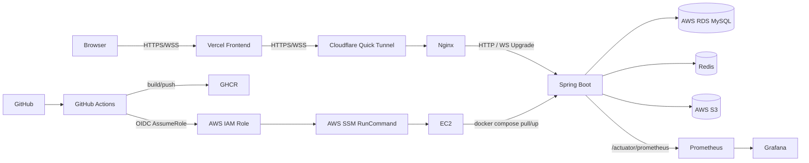
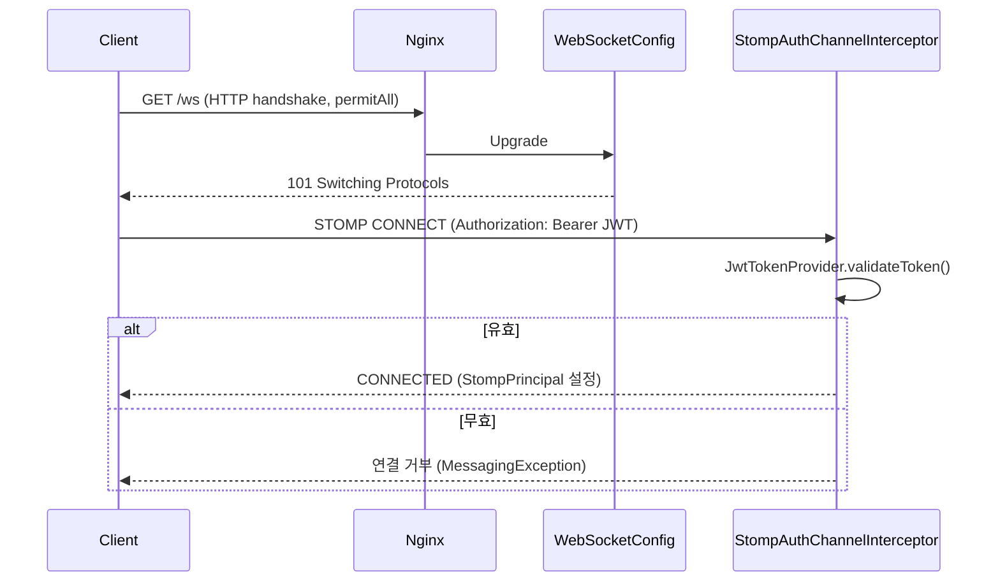

# GymFlow Architecture

## Document Information

| 항목 | 내용 |
|------|------|
| Document | Architecture |
| Version | v1.0 |
| Author | 정재윤 |
| Last Updated | 2026-09-04 |

이 문서는 GymFlow 전체 시스템이 어떻게 연결되는지를 다룬다. 도메인 모델은 [02_Domain_Design.md](./02_Domain_Design.md), 동시성 제어는 [04_Concurrency_Control.md](./04_Concurrency_Control.md), Redis/실시간 상세는 [05_Redis_Realtime.md](./05_Redis_Realtime.md), 배포/모니터링 상세는 [06_Deployment_Monitoring.md](./06_Deployment_Monitoring.md)를 참고한다.

---

## 1. System Overview



- Frontend는 Vercel에 배포되며, 백엔드로의 HTTPS/WSS 요청은 Cloudflare Quick Tunnel을 거쳐 EC2의 Nginx로 전달된다. Nginx는 일반 HTTP 요청과 WebSocket Upgrade 요청을 모두 백엔드 컨테이너로 프록시한다.
- Spring Boot는 MySQL(RDS)을 영속 Source of Truth로, Redis를 Lock/Queue/TTL/Cache/Ranking/Pub-Sub 용도로, S3를 Resource 이미지 저장소로 사용한다.
- 모니터링은 Spring Boot Actuator → Prometheus → Grafana 파이프라인으로 구성된다.
- 배포는 GitHub Actions가 GHCR에 이미지를 올리고, AWS OIDC로 발급받은 단기 자격 증명으로 SSM RunCommand를 통해 EC2에서 `docker compose pull/up`을 수행하는 방식이다.

Cloudflare Quick Tunnel은 포트폴리오 통합 환경을 위한 임시 HTTPS/WSS ingress이며, 운영 등급의 안정적인 ingress는 아니다. 자세한 내용은 [06_Deployment_Monitoring.md](./06_Deployment_Monitoring.md)의 Operational Characteristics를 참고한다.

---

## 2. Backend Layer Structure

패키지는 도메인 중심(domain-oriented)으로 구성되며, 각 도메인은 `Controller → Service → Repository`의 계층을 갖는다.

```
com.gymflow
├── domain
│   ├── user          (AuthController/UserController, User, UserRepository, AuthService/UserService)
│   ├── resource       (ResourceController/AdminResourceController, Resource/ReservationPolicy,
│   │                   Redis cache/ranking/availability-lock repository, S3 이미지 포트,
│   │                   ResourceService/AdminResourceService/AdminResourceImageService)
│   ├── reservation    (ReservationController, Reservation, Redis no-show/slot-lock repository,
│   │                   ReservationService, ReservationMetrics)
│   ├── waitingqueue   (WaitingQueueController/PromotionController, WaitingQueue/WaitingQueuePromotion,
│   │                   Redis lock/TTL/Pub-Sub repository, WaitingQueueService/PromotionService/PromotionProcessor)
│   ├── favorite       (FavoriteController, Favorite, FavoriteRepository, FavoriteService)
│   └── usagehistory   (UsageHistoryController, UsageHistory, UsageHistoryRepository, UsageHistoryService)
└── global
    ├── common         (annotation, constant, dto, entity, exception, response, transaction, util)
    ├── config
    ├── infrastructure/s3  (S3ResourceImageStorage)
    ├── metrics
    ├── redis
    ├── security       (config, jwt, principal, handler)
    ├── websocket       (StompAuthChannelInterceptor, StompPrincipal, WebSocketConfig)
    └── validator
```

각 도메인 패키지 내부의 `Controller`는 요청/응답 검증만 담당하고, 비즈니스 규칙은 `Service`에 위치한다. Redis 접근은 도메인별 Redis Repository로, MySQL 접근은 Spring Data JPA Repository로 분리되어 있다. Resource 이미지 저장처럼 외부 인프라(S3)에 대한 의존은 `domain/resource/domain/storage`의 포트 인터페이스(`ResourceImageStorage`)로 추상화하고, `global/infrastructure/s3`가 실제 구현을 제공한다.

---

## 3. Persistence Strategy

| Store | 역할 |
|---|---|
| MySQL | 영속 Source of Truth. User/Resource/Reservation/WaitingQueue/WaitingQueuePromotion/Favorite/UsageHistory 모든 Entity |
| Redis | 분산 Lock, 대기열 순번(ZSET), TTL 기반 자동 만료(NoShow/OFFERED/체크인 타임아웃), Resource 상세 캐시, 인기 Resource 랭킹(ZSET), Promotion 알림 Pub/Sub |
| S3 | Resource 대표 이미지 Object 저장소 (private bucket, Presigned GET URL로만 노출) |

Redis에만 존재하는 데이터(Lock, Queue rank, Cache, Ranking)는 모두 MySQL의 상태로부터 재구성 가능하거나, 없어도 핵심 정합성이 깨지지 않도록 설계되어 있다(Lock은 correctness에 직결되므로 예외 — 상세는 [04_Concurrency_Control.md](./04_Concurrency_Control.md) 참고). Redis 장애 시 기능별 처리 전략은 [05_Redis_Realtime.md](./05_Redis_Realtime.md)에서 다룬다.

---

## 4. Authentication Architecture

GymFlow는 HTTP REST API와 WebSocket(STOMP)에서 서로 다른 시점에 인증을 수행한다.

**HTTP**: `JwtAuthenticationFilter`(`OncePerRequestFilter`)가 모든 요청에서 `Authorization: Bearer <token>` 헤더를 검증하고 `SecurityContextHolder`에 인증 정보를 채운다. `SecurityConfig`는 `/api/users/signup`, `/api/auth/login`, `/ws/**`, `/actuator/health`, `/actuator/prometheus`를 `permitAll`로, `/api/admin/**`을 `hasRole("ADMIN")`으로, 나머지를 `authenticated()`로 지정한다.

**WebSocket**: `/ws` HTTP handshake 자체는 `permitAll`이다(SockJS/STOMP handshake 요청에는 JWT를 실을 수 없기 때문). 실제 인증은 STOMP `CONNECT` 프레임 단계에서 이루어진다. `StompAuthChannelInterceptor`가 `preSend()`에서 `CONNECT` 프레임의 `Authorization` 네이티브 헤더를 읽어 `JwtTokenProvider.validateToken()`으로 검증하고, 성공 시 `StompPrincipal`(사용자 id 기반 `Principal`)을 세션에 설정한다. 검증 실패 시 `MessagingException`을 던져 연결 자체를 거부한다.



두 인증 시점을 분리한 이유는 STOMP 프로토콜상 handshake 단계에는 커스텀 헤더를 안정적으로 실어 보낼 수 없고, 실제 사용자 식별이 필요한 시점은 `CONNECT` 프레임이기 때문이다.

---

## 5. Realtime Architecture

GymFlow에서 WebSocket/STOMP로 전파되는 이벤트는 **WaitingQueue Promotion 알림 1종**뿐이다. 예약 생성/취소/연장, 체크인/체크아웃, Resource 상태 변경은 WebSocket으로 전파되지 않으며 REST 응답으로만 클라이언트에 반영된다.

```
WaitingQueue Promotion (OFFERED 생성)
  → 트랜잭션 afterCommit
  → WaitingQueueEventPublisher (Redis Pub/Sub 발행)
  → WaitingQueueEventSubscriber (Redis 구독)
  → SimpMessagingTemplate.convertAndSendToUser(userId, "/queue/waiting-queue", event)
  → 클라이언트 구독 destination: /user/queue/waiting-queue
```

Redis Pub/Sub를 WebSocket 앞단에 둔 이유와, 트랜잭션 커밋 이후에만 발행하는 이유(과거 실제로 발생했던 race condition)는 [05_Redis_Realtime.md](./05_Redis_Realtime.md)와 [08_Troubleshooting.md](./08_Troubleshooting.md)에서 각각 다룬다.

---

## 6. Resource Image Architecture

Resource는 대표 이미지 1장을 가질 수 있으며, `Resource.imageKey`(nullable `String`, S3 Object Key만 저장)로 관리한다. 이미지 URL은 DB에 저장하지 않고, 조회 시점마다 `imageKey`로부터 1시간 유효한 **Presigned GET URL**을 새로 생성한다. S3 버킷은 private이며 공개 URL은 어디에서도 생성하지 않는다.

```
ResourceImageStorage (포트, domain/resource/domain/storage)
  ← S3ResourceImageStorage (구현체, global/infrastructure/s3)
      - upload(): PutObjectRequest
      - delete(): DeleteObjectRequest
      - generateReadUrl(): S3Presigner, Duration.ofHours(1)
```

MySQL(`Resource.imageKey`)과 S3 Object는 하나의 ACID 트랜잭션으로 묶이지 않으므로, `AdminResourceImageService`는 순서를 통해 정합성을 맞춘다.

**업로드/교체 (Fail-Closed 업로드)**
1. 새 Object를 S3에 먼저 업로드한다. 업로드 자체가 실패하면 `imageKey`를 변경하지 않고 API가 실패한다.
2. `resource.changeImageKey(newKey)`로 DB를 갱신한다.
3. `TransactionSynchronizationManager`로 커밋 이후 콜백을 등록한다.
   - COMMIT → 옛 Object 삭제(정상적인 교체 후 정리)
   - ROLLBACK → 방금 올린 새 Object 삭제(보상 삭제)

**삭제**
1. DB의 `imageKey`를 먼저 비우고 커밋한다.
2. 커밋 이후에만 S3 Object를 삭제한다.

이 순서를 지키는 이유는, 반대 순서(S3 먼저 삭제 후 DB 갱신)로 하면 DB 갱신이 실패했을 때 "DB에는 이미지가 남아있는데 실제 Object는 없는" 깨진 참조가 발생할 수 있기 때문이다. 현재 순서에서는 최소한 "DB에는 없는데 S3에는 orphan Object가 남는" 상황만 발생할 수 있다.

**Cleanup 실패 전략**: 커밋 이후 수행되는 S3 cleanup(옛 Object 삭제, rollback 보상 삭제) 실패는 Fail-Open으로 처리한다. 이미 커밋된 DB 상태를 되돌릴 방법이 없고, 이후 조회는 항상 최신 `imageKey` 기준으로 정상 동작하므로 WARN 로그만 남기고 stale S3 Object가 orphan으로 남을 수 있음을 감수한다.

---

## 7. Technology Decisions

| 기술 | 해결하는 문제 |
|---|---|
| Redis 분산 락 | 여러 WAS 인스턴스/스레드가 동일 Resource의 겹치는 시간대를 동시에 점유하려 할 때, DB 단일 트랜잭션 격리 수준만으로는 막기 어려운 동시 예약을 애플리케이션 레벨에서 직렬화한다. |
| Redis TTL + keyspace notification | 체크인 미이행(NoShow), Promotion 미응답, 승급 후 미체크인을 폴링 없이 자동으로 감지하고 후속 처리(승급 재시도 등)를 트리거한다. |
| Redis Pub/Sub | 단일 인스턴스 안에서 이벤트를 처리하는 대신, 트랜잭션 커밋과 WebSocket 알림 발행 사이에 명확한 경계를 두고, 향후 다중 인스턴스 환경에서도 알림이 인스턴스 경계를 넘어 전달되도록 한다. |
| STOMP (WebSocket) | 대기열 승급처럼 서버가 먼저 클라이언트에게 알려야 하는 이벤트를 폴링 없이 즉시 전달한다. |
| S3 Presigned URL | Resource 이미지를 public bucket 없이도 클라이언트가 직접 CDN처럼 접근할 수 있게 하면서, 접근 권한과 만료 시간을 서버가 통제한다. |
| Prometheus + Grafana | 예약 성공/충돌률, Lock 경합, 대기열 처리량 같은 비즈니스 지표와 JVM/HikariCP/Redis 같은 시스템 지표를 하나의 대시보드에서 함께 관찰한다. |
| GitHub Actions + AWS OIDC | 장기 AWS Access Key를 GitHub Secrets에 저장하지 않고, 배포 시점에만 단기 자격 증명을 발급받아 배포 파이프라인의 자격 증명 유출 위험을 줄인다. |
| Docker Compose | EC2 단일 호스트에서 backend/redis/nginx/모니터링 스택의 실행 단위를 명시적으로 관리하고, 배포 시 이미지 교체만으로 롤아웃한다. |

---

## Next Document

[04_Concurrency_Control.md](./04_Concurrency_Control.md)
