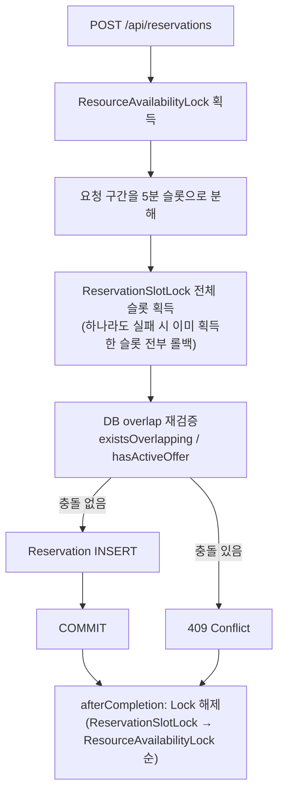

# GymFlow Concurrency Control

## Document Information

| 항목 | 내용 |
|------|------|
| Document | Concurrency Control |
| Version | v1.0 |
| Author | 정재윤 |
| Last Updated | 2026-09-04 |

이 문서는 "현재 시스템의 동시성 제어가 어떻게 동작하는가"를 다룬다. 왜 이런 구조가 필요하게 되었는지(과거 문제와 원인)는 [08_Troubleshooting.md](./08_Troubleshooting.md)에서 별도로 다룬다.

---

## 1. Protected Invariants

GymFlow의 동시성 제어는 다음 불변식을 보호하기 위해 존재한다.

- 같은 Resource의 겹치는 시간대에 점유 상태(`CONFIRMED`/`CHECKED_IN`) Reservation이 두 개 이상 존재할 수 없다.
- 관리자의 Resource 상태 변경(MAINTENANCE/INACTIVE 전환)과, 새로운 시간 점유를 만드는 작업(예약 생성, Promotion ACCEPT/OFFERED 생성)이 서로를 무시한 채 동시에 성공할 수 없다.
- 동일 Resource + 시간 구간에 대해 두 개 이상의 Active `OFFERED` Promotion이 동시에 존재할 수 없다(Promotion 우선권 보호).
- 같은 사용자가 같은 대기열 등록 요청을 동시에 중복 제출해도 하나만 처리된다.

이 네 가지를 보호하는 수단이 4종의 Redis 분산 락이며, 락만으로 정합성을 완전히 위임하지 않고 락 내부에서 DB 재검증을 함께 수행한다.

---

## 2. Lock Inventory

모든 락은 동일한 원리를 사용한다: `SETNX(key, token, TTL)`으로 획득하고, 해제 시 `GET(key)==token`을 확인한 뒤 `DEL`하는 Lua 스크립트(CAS)로 해제한다. 이를 통해 TTL 만료 후 다른 요청이 획득한 락을 이전 소유자가 실수로 지우는 것을 방지한다.

| Lock | Redis Key | Scope | TTL | Purpose | Metrics |
|---|---|---|---|---|---|
| `ResourceAvailabilityLock` | `gymflow:lock:resource-availability:{resourceId}` | Resource 전체 | 5s | Resource 상위 concurrency boundary. 예약 생성/Promotion ACCEPT·OFFERED 생성과 관리자 상태 변경을 직렬화 | O (`resource-availability`) |
| `ReservationSlotLock` | `gymflow:lock:reservation-slot:{resourceId}:{slotStart}` (구간 내 5분 슬롯마다 1개) | Resource의 시간 점유 그리드 | 5s | 겹치는 `[startAt, endAt)` 요청이 항상 최소 하나의 슬롯을 공유하도록 보장 | O (`reservation-slot`) |
| `PromotionLock` | `gymflow:lock:promotion:{resourceId}:{startAt}:{endAt}` | 특정 Resource+시간 구간의 Promotion 상태 | 5s | OFFERED 생성, ACCEPT/REJECT, 만료/체크인 타임아웃 처리 사이의 경쟁 직렬화 | X |
| `WaitingQueueRegistrationLock` | `gymflow:lock:waiting-queue:{userId}:{resourceId}:{startAt}:{endAt}` | 같은 사용자의 같은 등록 요청 | 5s | 동일 사용자가 동일 요청을 동시에 중복 제출하는 것만 직렬화(Resource 점유권과 무관) | X |

각 락 키 클래스: `ResourceAvailabilityLockKey`, `ReservationSlotLockKey`, `PromotionLockKey`, `WaitingQueueRegistrationLockKey` (각 도메인 패키지의 `domain/redis` 하위).

---

## 3. Global Lock Ordering

세 종류 이상의 락을 함께 사용하는 흐름(Promotion ACCEPT, 자동 재승급)은 항상 다음 순서로 획득하고, 해제는 역순으로 수행한다.

```
ResourceAvailabilityLock → PromotionLock → ReservationSlotLock
```

이 순서는 런타임에 강제되는 별도 가드가 있는 것은 아니고, 모든 호출부(`PromotionProcessor.tryPromote()`, `PromotionService.accept()`, `ReservationService.doCreateReservation()`)가 이 순서를 지키도록 코드로 통일되어 있다. 일반 예약 생성처럼 `PromotionLock`이 필요 없는 흐름은 `ResourceAvailabilityLock → ReservationSlotLock` 순서만 사용하며, 이는 전역 순서의 부분집합이므로 순서 위반이 아니다.

순서를 하나로 고정한 이유는 Deadlock 방지다. 서로 다른 요청이 반대 순서로 락을 획득하면 순환 대기가 발생할 수 있는데, 프로젝트 전체에서 획득 순서가 뒤바뀌는 경로가 없도록 통일했다.

---

## 4. Reservation Creation Flow



`ReservationService.doCreateReservation()` 기준 실제 순서: `ResourceAvailabilityLock` 획득 → `ReservationSlotLockRepository.tryLockAll()`로 canonical 슬롯 전체 획득 → `reservationRepository.existsOverlapping()` / `promotionService.hasActiveOffer()`로 DB 재검증 → `Reservation` 저장 → 트랜잭션 커밋 → `TransactionAwareLockReleaser`가 등록한 콜백으로 슬롯 락 → Resource 락 순으로 해제.

---

## 5. Canonical 5-minute Slot Lock

`ReservationSlotLock`은 요청의 정확한 시각 문자열이 아니라, Resource + 절대 5분 grid 슬롯 단위로 획득한다.

```java
static final int SLOT_MINUTES = 5;

public static List<LocalDateTime> canonicalSlots(LocalDateTime startAt, LocalDateTime endAt) {
    List<LocalDateTime> slots = new ArrayList<>();
    LocalDateTime current = floorToSlot(startAt);
    while (current.isBefore(endAt)) {
        slots.add(current);
        current = current.plusMinutes(SLOT_MINUTES);
    }
    return slots;
}

private static LocalDateTime floorToSlot(LocalDateTime time) {
    LocalDateTime truncated = time.truncatedTo(ChronoUnit.MINUTES);
    int remainder = truncated.getMinute() % SLOT_MINUTES;
    return truncated.minusMinutes(remainder);
}
```

과거에는 `{resourceId}:{startAt}:{endAt}`을 그대로 락 키로 사용했다. 이 방식은 정확히 같은 시작/종료 시각의 요청만 직렬화할 뿐, 겹치기만 하고 시작/종료가 다른 두 요청은 서로 다른 키를 얻어 직렬화되지 않는 한계(write-skew)가 있었다. 5분 grid로 분해하면 겹치는 두 시간 구간은 항상 최소 하나의 슬롯을 공유하므로, 두 요청은 반드시 하나의 슬롯 락을 두고 경쟁하게 된다. 이 문제가 실제로 어떻게 발견되고 고쳐졌는지는 [08_Troubleshooting.md](./08_Troubleshooting.md#b-reservation-write-skew-from-exact-timestamp-lock-key)에서 다룬다.

예약 연장은 새로 점유하는 구간(`oldEndAt ~ newEndAt`)만 슬롯 락을 걸며, 이미 점유 중인 구간은 커밋된 상태에 대한 overlap 재검증만으로 충분히 보호된다.

---

## 6. TransactionAwareLockReleaser

Spring `@Transactional` 메서드의 실제 COMMIT은 Service 메서드가 return한 이후 프록시 바깥에서 일어난다. 따라서 lock 해제를 메서드 `finally`에서 즉시 수행하면, "Redis unlock은 끝났지만 DB COMMIT은 아직 안 된" 짧은 구간이 생기고, 그 사이에 다른 요청이 같은 락을 재획득해 아직 커밋되지 않은 변경을 보지 못한 채 동일한 검증을 통과할 수 있다.

이를 막기 위해 `TransactionAwareLockReleaser`는 락 해제를 `TransactionSynchronization.afterCompletion()` 시점으로 미룬다.

```java
public boolean register(Runnable unlockAction) {
    if (!TransactionSynchronizationManager.isSynchronizationActive()
            || !TransactionSynchronizationManager.isActualTransactionActive()) {
        return false;
    }
    try {
        TransactionSynchronizationManager.registerSynchronization(new TransactionSynchronization() {
            @Override
            public void afterCompletion(int status) {
                try {
                    unlockAction.run();
                } catch (RuntimeException e) {
                    log.warn("Transaction completion 이후 Lock 해제 중 오류가 발생했습니다. status={}", status, e);
                }
            }
        });
        return true;
    } catch (RuntimeException e) {
        log.warn("Transaction synchronization 등록에 실패해 즉시 Lock 해제로 대체합니다.", e);
        return false;
    }
}
```

호출부는 모두 동일한 형태를 따른다.

```
boolean deferred = lockReleaser.register(unlockAction);
try {
    // 비즈니스 로직
} finally {
    if (!deferred) unlockAction.run();
}
```

Spring 트랜잭션 동기화가 활성화되지 않은 실행 경로(예: Spring 컨텍스트 없이 Service를 직접 호출하는 단위 테스트)에서는 `register()`가 `false`를 반환하고, 호출부는 기존과 동일하게 `finally`에서 즉시 해제한다. 이 구조가 실제로 막아낸 race condition의 재현/검증은 [08_Troubleshooting.md](./08_Troubleshooting.md#d-promotion-follow-up-self-contention-and-lock-release-timing)에서 다룬다.

---

## 7. DB Revalidation

Redis 락은 "동시에 같은 자원을 건드리는 요청을 직렬화"할 뿐, 어떤 상태가 옳은지는 판단하지 않는다. 락을 획득했다고 해서 곧바로 쓰기를 수행하지 않고, 락 안에서 MySQL의 현재 상태를 다시 조회해 충돌을 재검증한다.

- `ReservationService.doCreateReservation()`: `reservationRepository.existsOverlapping(...)` + `promotionService.hasActiveOffer(...)`
- `ReservationService.extendReservation()`: `reservationRepository.existsOverlappingExcludingReservation(...)`
- `PromotionService.accept()`: `reservationRepository.existsOverlapping(...)`
- `PromotionProcessor.tryPromote()`: `promotionRepository.existsOverlapping(...)`

Redis는 보조 수단이고 MySQL이 Source of Truth이기 때문이다. 락 획득 이전에 수행한 사전 검증(예: API 진입 시 1차 검사)은 락을 얻기까지의 대기 시간 동안 다른 트랜잭션이 커밋되었을 수 있으므로 신뢰할 수 없고, 락 내부의 재검증만이 최종 판단 기준이 된다.

---

## 8. Promotion / Resource State / WaitingQueue Boundaries

- **Promotion**: OFFERED 생성(`PromotionProcessor.tryPromote()`), ACCEPT(`PromotionService.accept()`), REJECT/만료/체크인 타임아웃 처리는 모두 `PromotionLock`으로 상태 전이를 직렬화한다. `PromotionLock`은 Promotion 상태만 보호하며 Resource 시간 점유권 자체는 보호하지 않는다.
- **Resource 상태 변경**: `AdminResourceService.changeStatus()`가 MAINTENANCE/INACTIVE로 전환할 때 `ResourceAvailabilityLock`을 획득한 뒤 그 안에서 점유 여부(현재/미래 점유 Reservation, 활성 OFFERED Promotion)를 검사한다. 같은 락을 예약 생성/Promotion ACCEPT·OFFERED 생성도 공유하므로, "관리자가 점유 없음을 확인한 직후 새 점유가 끼어드는" write-skew가 발생하지 않는다.
- **WaitingQueue 등록**: `WaitingQueueRegistrationLock`은 Resource 점유권과 무관하게, 같은 사용자의 같은 등록 요청만 직렬화한다. 서로 다른 사용자의 동일 시간대 등록이나 같은 사용자의 다른 시간대 등록은 이 락으로 직렬화되지 않는다.

---

## 9. Metrics

`LockMetrics`(`global/metrics`)는 `ResourceAvailabilityLockRepository`와 `ReservationSlotLockRepository`에서만 호출된다(`PromotionLock`, `WaitingQueueRegistrationLock`은 계측되지 않는다).

| Metric | Type | 의미 |
|---|---|---|
| `gymflow_lock_acquired_total{lock_name}` | Counter | 락 획득 성공 횟수 |
| `gymflow_lock_failed_total{lock_name}` | Counter | 락 획득 실패 횟수 |
| `gymflow_lock_wait_seconds{lock_name}` | Timer | `SETNX` 시도 자체의 latency |

`gymflow_lock_wait_seconds`는 이름과 달리 "락을 얻기 위해 대기열에서 기다린 시간"이 아니라, 재시도 없는 단발성 `tryLock` 호출의 attempt latency다. GymFlow의 락은 대기(blocking) 없이 즉시 성공/실패를 반환하는 방식이므로, 이 지표는 Redis 자체의 응답 지연을 관찰하는 용도로 해석해야 한다. Grafana Dashboard의 실제 패널 구성은 [06_Deployment_Monitoring.md](./06_Deployment_Monitoring.md)를 참고한다.

---

## 10. Trade-off

`ResourceAvailabilityLock`은 Resource 단위로 잠그는 coarse-grained 락이다. 같은 Resource에 대한 서로 다른 시간대의 예약 생성 요청도 이 락 하나를 두고 경쟁하므로, 이론적으로는 실제로는 충돌하지 않을 두 요청이 잠깐 순서를 기다릴 수 있다.

현재 목표 부하([07_Test_Performance.md](./07_Test_Performance.md) 참고)에서는 이 coarse-grained lock으로 인한 병목이 관측되지 않았고, Resource 상태 변경과 시간 점유 생성 사이의 write-skew를 막는 것이 최우선 요구사항이었기 때문에 correctness와 구현 단순성을 우선했다. Resource당 매우 높은 동시 예약 요청이 발생하는 시나리오에서는 이 락을 시간 구간 단위로 더 세분화하는 것을 향후 개선 과제로 남겨둔다.

---

## Next Document

[05_Redis_Realtime.md](./05_Redis_Realtime.md)
