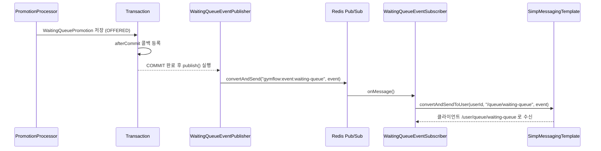

# GymFlow Redis & Realtime

## Document Information

| 항목 | 내용 |
|------|------|
| Document | Redis & Realtime |
| Version | v1.0 |
| Author | 정재윤 |
| Last Updated | 2026-09-04 |

이 문서는 Redis가 GymFlow에서 맡는 역할과, WaitingQueue Promotion 알림이 WebSocket까지 전달되는 흐름을 다룬다. Redis 기반 분산 락은 정합성 보호 목적이 더 커서 [04_Concurrency_Control.md](./04_Concurrency_Control.md)에서 다룬다.

---

## 1. Redis Responsibility Map

| 역할 | 사용처 |
|---|---|
| Distributed Lock | 예약/Promotion/대기열 등록 동시성 제어 ([04](./04_Concurrency_Control.md)) |
| WaitingQueue FIFO | 대기 순번 관리 (Sorted Set) |
| TTL Lifecycle | NoShow / Promotion OFFERED 만료 / 체크인 타임아웃 자동 처리 |
| Resource Cache | Resource 상세 조회 캐시 |
| Resource Ranking | 인기 Resource 랭킹 (Sorted Set) |
| Pub/Sub | Promotion 알림을 WebSocket으로 전달하기 위한 브릿지 |
| Keyspace Expiration | TTL 만료 이벤트 감지 |

---

## 2. Redis Key Inventory

| Key | 용도 | 자료구조 |
|---|---|---|
| `gymflow:lock:resource-availability:{resourceId}` | ResourceAvailabilityLock | String (SETNX) |
| `gymflow:lock:reservation-slot:{resourceId}:{slotStart}` | ReservationSlotLock (5분 슬롯별) | String (SETNX) |
| `gymflow:lock:promotion:{resourceId}:{startAt}:{endAt}` | PromotionLock | String (SETNX) |
| `gymflow:lock:waiting-queue:{userId}:{resourceId}:{startAt}:{endAt}` | WaitingQueueRegistrationLock | String (SETNX) |
| `gymflow:queue:{resourceId}:{startAt}` | 대기열 순번 | Sorted Set |
| `gymflow:queue:{resourceId}:{startAt}:sequence` | 대기열 순번 채번용 단조 증가 카운터 | String (INCR) |
| `gymflow:promotion:offered:{promotionId}` | Promotion OFFERED 만료 TTL | String + TTL |
| `gymflow:promotion:checkin:{reservationId}` | Promotion 수락 후 체크인 타임아웃 TTL | String + TTL |
| `gymflow:reservation:noshow:{reservationId}` | 일반 예약 NoShow TTL | String + TTL |
| `gymflow:resource:{resourceId}` | Resource 상세 캐시 | String (JSON) |
| `gymflow:ranking:resource:reservation` | 인기 Resource 랭킹 | Sorted Set |

Pub/Sub 채널: `gymflow:event:waiting-queue`

---

## 3. WaitingQueue FIFO

**문제**: 초기 구현은 대기열 등록 시각(`createdAt`)의 밀리초 타임스탬프를 ZSET score로 사용했다. 동시에 들어온 두 요청이 같은 밀리초에 등록되면 score가 충돌해 순서가 불안정해질 수 있었다.

**선택**: score를 요청 시각이 아니라, Resource+시간대별로 채번하는 단조 증가 정수(sequence)로 바꾼다.

**구현**: `INCR`(sequence 채번) → `ZADD`(score=sequence로 등록) → `ZRANK`(현재 순위 조회)를 하나의 Lua 스크립트로 원자 실행한다.

```lua
local sequence = redis.call('INCR', KEYS[1])
redis.call('ZADD', KEYS[2], sequence, ARGV[1])
return redis.call('ZRANK', KEYS[2], ARGV[1])
```

`KEYS[1]`은 `gymflow:queue:{resourceId}:{startAt}:sequence`, `KEYS[2]`는 `gymflow:queue:{resourceId}:{startAt}`이다. 세 연산이 하나의 스크립트 안에서 원자적으로 실행되므로, 서로 다른 사용자의 요청이 동시에 들어와도 "내가 ZADD한 직후, 내가 ZRANK를 조회하기 전에 다른 요청의 ZADD가 끼어드는" 일이 없다. 그 결과 score(=sequence) 동률도, rank 중복도 발생할 수 없다.

제거 시(`WaitingQueueRedisRepository.remove()`)에도 `ZREM` 후 `ZCARD`가 0이면 sequence 키를 함께 `DEL`하는 스크립트를 사용해, 대기열이 완전히 비면 채번 카운터도 함께 정리한다.

이 문제가 실제로 어떻게 재현되고 고쳐졌는지는 [08_Troubleshooting.md](./08_Troubleshooting.md#a-waitingqueue-fifo-timestamp-score-collision--monotonic-sequence)에서 다룬다.

---

## 4. TTL Lifecycle

세 가지 TTL이 Redis keyspace 만료 이벤트로 감지되며, 각각 전담 Listener(`KeyExpirationEventMessageListener` 구현체)가 후속 처리를 수행한다.

| 구분 | Key | TTL | Listener | 만료 후 처리 |
|---|---|---|---|---|
| 예약 NoShow | `gymflow:reservation:noshow:{reservationId}` | `startAt - now` (예약 시작 시각에 맞춰 만료) | `ReservationNoShowListener` | `CONFIRMED`면 `NO_SHOW`로 전이 후 `PromotionProcessor.tryPromote()`로 대기열 승급 시도 |
| Promotion OFFERED | `gymflow:promotion:offered:{promotionId}` | `min((endAt - now) - minDuration, 2분)` | `PromotionOfferedListener` | `OFFERED`면 `EXPIRED`로 전이 후 같은 슬롯에 대해 `tryPromote()` 재시도(다음 대기자에게 승급) |
| Promotion 체크인 타임아웃 | `gymflow:promotion:checkin:{reservationId}` | 1분 고정 | `PromotionCheckInListener` | `CONFIRMED`면 `CANCELLED`(`PROMOTION_CHECKIN_TIMEOUT`)로 취소 후 `tryPromote()` 재시도 |

세 TTL 모두 폴링 없이, Redis가 키 만료 시점에 발행하는 keyspace notification(`__keyevent@*__:expired`)을 구독해 처리한다.

**운영 시 주의점**: 이 프로젝트는 `notify-keyspace-events`를 명시적으로 설정하지 않는다. Spring Data Redis의 `KeyExpirationEventMessageListener`가 기본값(`ConfigureRedisAction.ALL`)으로 애플리케이션 시작 시 Redis 서버에 `CONFIG SET notify-keyspace-events Ex`를 대신 실행해주기 때문에 동작한다. 즉 이 기능은 "런타임에 `CONFIG SET`이 허용되는 Redis"라는 암묵적인 전제 위에서 동작하며, `CONFIG SET`이 제한된 관리형 Redis(예: 일부 클라우드 관리형 서비스의 제약된 파라미터 그룹) 환경에서는 별도 설정이 필요할 수 있다.

---

## 5. Resource Cache

- Key: `gymflow:resource:{resourceId}`
- TTL: 10분(`Duration.ofMinutes(10)`)
- Read-through 캐시: `ResourceService.getResourceDetail()`이 캐시를 먼저 조회하고, miss 시 DB 조회 후 캐시에 채운다. 캐시에는 이미 resolve된 `imageUrl`(Presigned URL)을 포함한 응답 전체를 저장한다.
- Eviction 시점: `AdminResourceService`의 Resource 수정/상태 변경 성공 시, `AdminResourceImageService`의 이미지 업로드/삭제 성공 시.
- 캐시 TTL(10분)이 Presigned URL 유효기간(1시간)보다 항상 짧게 유지되는 한, 캐시가 만료된 URL을 반환하는 일은 없다(캐시 자체가 URL보다 먼저 사라진다). 두 값 중 하나라도 바뀌어 TTL ≥ 유효기간이 되면 이 전제가 깨지므로 함께 재검토해야 한다.

---

## 6. Popular Resource Ranking

- Key: `gymflow:ranking:resource:reservation` (ZSET)
- 예약 생성이 성공할 때마다 `ZINCRBY`로 해당 Resource의 score를 1 증가시킨다(`ReservationService.incrementResourceRanking()`). 예약 취소/NO_SHOW/체크아웃 시 감소나 재계산은 하지 않는다.
- Resource 상태가 MAINTENANCE/INACTIVE로 바뀌어도 ZSET의 score/membership은 그대로 유지된다. 대신 사용자에게 노출하는 랭킹(`GET /api/resources/rankings`, `GET /api/resources/{resourceId}/ranking`)은 ACTIVE Resource만 필터링한 뒤 1부터 시작하는 연속 순위를 다시 매긴다(`ResourceService`가 20개 단위 배치로 Redis raw ranking을 스캔하며 MySQL에서 ACTIVE 여부를 확인).
- **조회 Fail-Open**: Redis 조회가 실패하면 TOP N 조회는 빈 목록을, 특정 Resource 조회는 `rank=null, score=0`을 반환한다. 예외를 클라이언트에 그대로 전파하지 않는다.

---

## 7. Pub/Sub → WebSocket Bridge



`WaitingQueueEventPublisher.publish()`는 `TransactionSynchronizationManager`로 활성 트랜잭션의 `afterCommit()` 콜백을 등록하고, 그 시점에만 실제 `redisTemplate.convertAndSend()`를 호출한다(활성 트랜잭션이 없으면 즉시 발행). 트랜잭션 커밋 이전에 알림이 나가지 않도록 보장하는 이 순서는 과거 실제로 발생했던 문제를 고친 결과이며, 자세한 내용은 [08_Troubleshooting.md](./08_Troubleshooting.md#e-websocket-notification-before-db-commit)에서 다룬다.

`WaitingQueueEventSubscriber`는 `MessageListener`로 등록되어 채널을 구독하고, 수신한 이벤트를 `SimpMessagingTemplate.convertAndSendToUser(userId, "/queue/waiting-queue", event)`로 전달한다. `convertAndSendToUser`의 사용자 prefix와 결합되어 실제 목적지는 `/user/{userId}/queue/waiting-queue`이며, 클라이언트는 `/user/queue/waiting-queue`를 구독한다.

GymFlow 코드 전체에서 `convertAndSend`류 호출은 이 흐름(Publisher의 Redis 발행, Subscriber의 STOMP 발행) 두 곳뿐이다. 예약 생성/취소/연장, 체크인/체크아웃, Resource 상태 변경은 WebSocket으로 전파되지 않는다.

---

## 8. STOMP Authentication

- `/ws` HTTP handshake는 `SecurityConfig`에서 `permitAll`이다.
- 실제 인증은 STOMP `CONNECT` 프레임에서 이루어진다. `StompAuthChannelInterceptor`(`ChannelInterceptor`)가 `preSend()`에서 `CONNECT` 프레임의 `Authorization` 헤더(`Bearer <JWT>`)를 읽어 `JwtTokenProvider.validateToken()`으로 검증한다.
- 검증에 성공하면 `StompPrincipal`(JWT에서 추출한 사용자 id를 담은 `Principal` record)을 세션에 설정한다. 이 Principal의 `name`이 `convertAndSendToUser(String.valueOf(userId), ...)`가 목적지를 매칭하는 기준이 된다.
- 검증에 실패하면 `MessagingException`을 던져 연결 자체를 거부한다.

상세 시퀀스는 [03_Architecture.md](./03_Architecture.md#4-authentication-architecture)를 참고한다.

---

## 9. Failure Strategy

Redis 장애를 "Fail-Open"이라는 한 문장으로 뭉뚱그리지 않고, 기능별로 다르게 처리한다.

| 기능 | 전략 | 이유 |
|---|---|---|
| Distributed Lock (4종) | 락 획득 실패 시 해당 요청을 즉시 실패 처리한다(재시도 없음). Correctness가 최우선이므로 락 없이 쓰기를 진행하지 않는다. | Redis 없이 동시 쓰기를 허용하면 중복 예약/write-skew를 막을 방법이 없다 |
| Resource Cache | 캐시 read/write/evict 실패는 로그만 남기고 무시한다(Fail-Open). MySQL 조회로 자연히 대체된다 | 캐시는 성능 최적화 목적이며 없어도 정답을 낼 수 있다 |
| Popular Resource Ranking | 조회 실패 시 TOP N은 빈 목록, 특정 Resource는 `rank=null/score=0`으로 응답한다(Fail-Open) | 랭킹은 부가 정보이며 예약 흐름의 정합성과 무관하다 |
| Pub/Sub → WebSocket | 발행은 트랜잭션 커밋 이후에만 일어나므로, 발행 자체가 실패해도 MySQL의 Promotion 상태는 이미 확정되어 있다. 사용자는 실시간 알림만 받지 못하고, REST 재조회로는 정상적으로 최신 상태를 확인할 수 있다 | 알림은 UX 보조 수단이며 상태의 Source of Truth가 아니다 |
| TTL/Keyspace Expiration | Redis 자체가 다운되면 만료 이벤트가 발생하지 않아 NoShow/Promotion 만료 처리가 지연된다. 별도의 fallback 배치는 두지 않는다 | 현재 MVP 범위의 알려진 한계로 남겨둔다 |

---

## Next Document

[06_Deployment_Monitoring.md](./06_Deployment_Monitoring.md)
